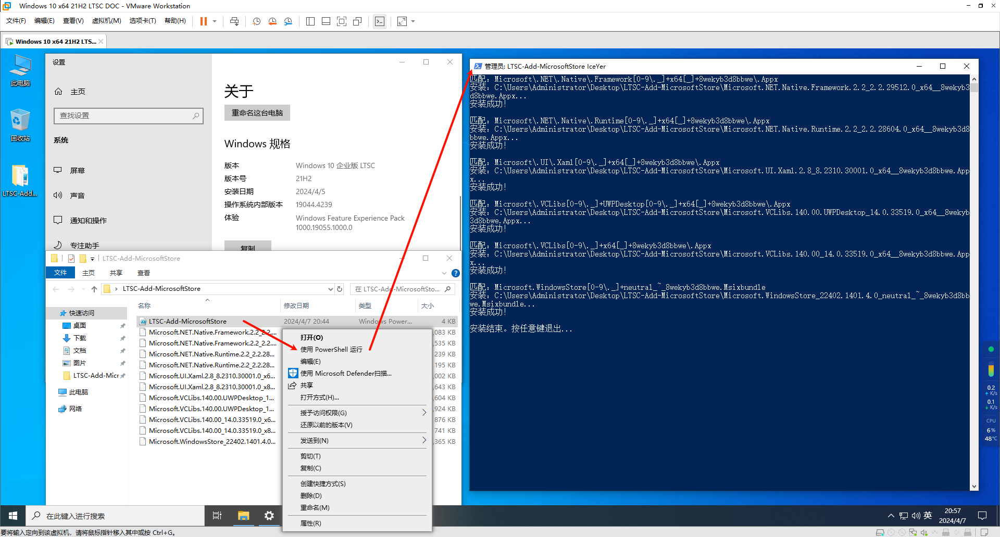
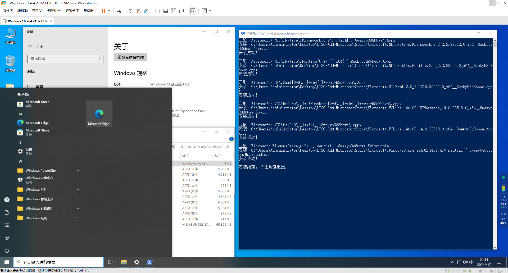

# Windows 10 LTSC 2021 安装微软商店
最近在封装 Windows 10 LTSC 2021 时，默认没有安装微软商店。

使用 `wsreset -i` 确实能恢复微软商店，但是封装提示非所有用户安装。而在查阅了现有的项目后，发现它们要么时间久远，要么兼容性差。虽然看到有使用 cmd 脚本的解决方案，但既然它们也是调用 PowerShell，为什么不直接使用 PowerShell 脚本呢？

所以此脚本诞生了，理论上它兼容 Windows 10 及以上版本，但前提是必须已经安装了 PowerShell。


## 如何使用？
PowerShell脚本已经自动识别x86及x64版本，并按照顺序安装，有任何问题可以提问。

1.确保PowerShell脚本(.ps1文件)与离线包在同一文件夹内然后鼠标右键，选择用 PowerShell 运行，稍等片刻直到提示安装结束；



2.安装顺利的话，你可以在开始菜单找到Microsoft Store应用程序。




## 如何获取最新的微软商店离线包？


若要获取最新的离线微软商店安装包，请按照以下步骤操作：

1.打开 [https://store.rg-adguard.net](https://store.rg-adguard.net)；

2.选择 `PackageFamilyName` 选项后在搜索框中输入 `Microsoft.WindowsStore_8wekyb3d8bbwe` 并进行搜索；

3.你会看到很多组件及其不同版本。如果你是 Windows 用户，需要特别关注文件名结尾为 `x64__8wekyb3d8bbwe.appx`、`x86__8wekyb3d8bbwe.appx` 或 `8wekyb3d8bbwe.msixbundle` 的组件；

4.[然后再看如何使用](#如何使用)


## 如何更改脚本中获取的包文件名或安装顺序？
如果后续版本升级，只改变版本号的话，那么可以不用修改。

如果更改了名字结构或者增删了某个组件，需要在脚本中找到下面内容，支持正则匹配，其中$architecture表示自动获取x86或x64。

在更新这些正则表达式时，请确保准确匹配您希望安装的包文件名。推荐一个正则网站[https://regex101.com](https://regex101.com)。

安装顺序可自行调整对应行；

```powershell
$regexPatterns = @(
    "Microsoft\.NET\.Native\.Framework[0-9\._]+$architecture[_]+8wekyb3d8bbwe\.Appx",
    "Microsoft\.NET\.Native\.Runtime[0-9\._]+$architecture[_]+8wekyb3d8bbwe\.Appx",
    "Microsoft\.UI\.Xaml[0-9\._]+$architecture[_]+8wekyb3d8bbwe\.Appx",
    "Microsoft\.VCLibs[0-9\._]+UWPDesktop[0-9\._]+$architecture[_]+8wekyb3d8bbwe\.Appx",
    "Microsoft\.VCLibs[0-9\._]+$architecture[_]+8wekyb3d8bbwe\.Appx",
    "Microsoft.WindowsStore[0-9\._]+neutral_~_8wekyb3d8bbwe.Msixbundle"
)
