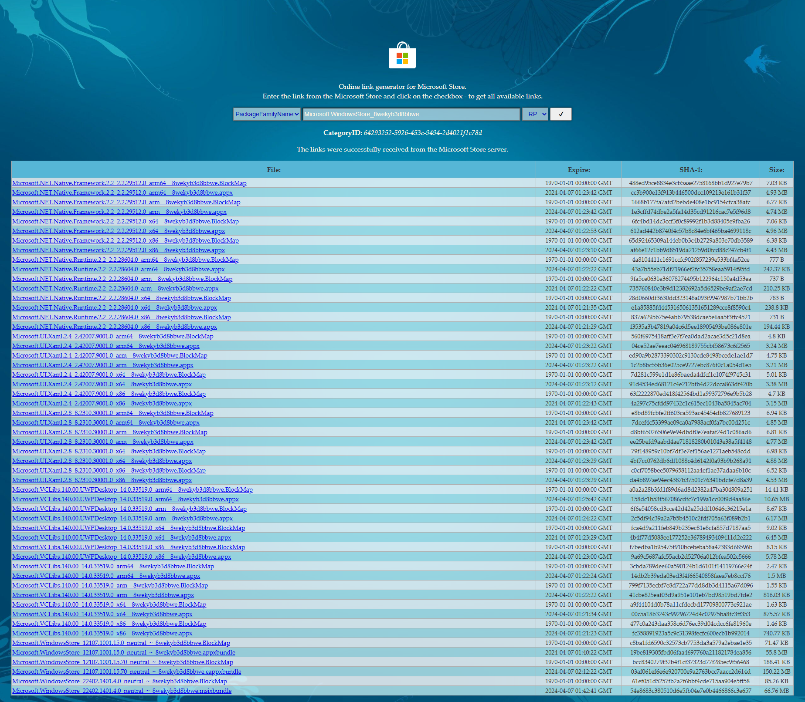

# Windows 11 LTSC 2024 安装微软商店
封装 Windows LTSC 版时，默认没有安装微软商店。

使用`wsreset -i`确实能恢复微软商店，但是封装提示非所有用户安装导致封装报错。

查阅了现有的项目后，有使用CMD脚本的解决方案，但时间久远不适用于新版微软商店，手动修改后替换新版离线包后封装依旧提示非所有用户安装。

最后了解到内部实现方式是调用PowerShell使用Add-AppxPackage命令。在搜索资料时发现还有Add-AppxProvisionedPackage命令：
| 命令 | 说明 |
| -------- | -------- |
| Add-AppxPackage     | 为当前用户安装一个appx程序包。     |
| Add-AppxProvisionedPackage     | 安装appx程序包到计算机，所有的用户都将默认安装此appx程序包。     |

测试使用`Add-AppxProvisionedPackage`命令安装后，封装不再提示非所有用户安装。

于是开始修改了CMD脚本，后面发现直接使用PowerShell（窗口）运行安装命令，安装进度更加直观...

故此PowerShell脚本诞生了（cmd只负责调用这个PowerShell脚本）：

1.理论上，安装了`PowerShell`，并支持上述命令即可使用。

2.根据设定的包名顺序安装，支持正则匹配包名，可区分x86或x64。


## 一、如何使用
1.确保Bat批处理(.bat文件)、PowerShell脚本(.ps1文件)、程序离线包在同一文件夹内；

2.双击或右键运行`LTSC-Add-MicrosoftStore.bat`会罗列匹配到的文件列表，确认后，按任意键继续安装；

3.顺利的话，你可以在开始菜单找到`Microsoft Store`应用程序。


## 二、如何获取最新的微软商店离线包


若要获取最新的离线微软商店安装包，请按照以下步骤操作：

1.打开 [https://store.rg-adguard.net](https://store.rg-adguard.net)；

2.选择`PackageFamilyName`选项，在搜索框中输入`Microsoft.WindowsStore_8wekyb3d8bbwe`点击`√`搜索；

3.你会看到很多组件及其不同版本。需要特别关注包名结尾为`x64__8wekyb3d8bbwe.appx`、`x86__8wekyb3d8bbwe.appx`、`8wekyb3d8bbwe.msixbundle`根据需求下载；

4.[然后再看如何使用](#一如何使用)


## 三、如何更改脚本中匹配的包文件名或安装顺序
1.如果后续版本升级，只改变版本号的话，那么可以不用修改脚本。

2.如果更改了名字结构，需要在脚本中找到下方内容进行修改，每行一个用`"`包裹，最后一个尾部不用加`,`。包名支持[正则匹配](https://regex101.com)，其中`$architecture`获取当前系统为`x86`或`x64`。在更新这些正则表达式时，请确保准确。若险麻烦可直接填入文件名，不要加入路径。
```powershell
$regexPatterns = @(
    "Microsoft.NET.Native.Framework[0-9\._]+${architecture}__8wekyb3d8bbwe.Appx",
    "Microsoft.NET.Native.Runtime[0-9\._]+${architecture}__8wekyb3d8bbwe.Appx",
    "Microsoft.UI.Xaml[0-9\._]+${architecture}__8wekyb3d8bbwe.Appx",
    "Microsoft.VCLibs[0-9\._]+UWPDesktop[0-9\._]+${architecture}__8wekyb3d8bbwe.Appx",
    "Microsoft.VCLibs[0-9\._]+${architecture}__8wekyb3d8bbwe.Appx",
    "Microsoft.Services.Store.Engagement[0-9\._]+${architecture}__8wekyb3d8bbwe.Appx",
    "Microsoft.WindowsStore[0-9\._]+neutral_~_8wekyb3d8bbwe.Msixbundle"
)
```
3.如果增删了某个组件，请调整对应行，安装会根据填写的顺序执行。
